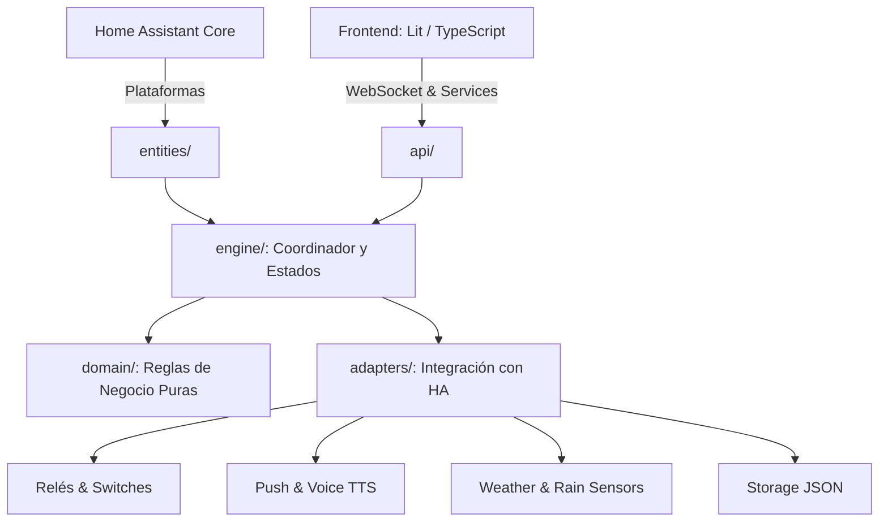

# 🌱 Irrigation Scheduler v1.1.0

[](https://www.home-assistant.io/)
[](https://hacs.xyz/)
[](https://lit.dev/)
[](https://www.python.org/)
[](LICENSE)

> **Integración de Home Assistant para el control inteligente, seguro y visual del riego automático multizona.**

---

## 🎯 Propósito del Proyecto

Convierte cualquier entidad `switch` (relés o enchufes) en un programador de riego multizona profesional.

Basado en **Clean Architecture**:
- 💧 **Ahorro hídrico:** omisión por lluvia y datos meteorológicos.
- 🔒 **Protección activa:** corte por falta de agua, control de sobretiempos y recuperación tras caída de HA.
- ⚡ **Interfaz visual:** panel lateral propio y tarjetas Lovelace interactivas en tiempo real.

---

## 🚦 Estado Actual y Roadmap del Proyecto

| Módulo / Funcionalidad | Estado | Situación |
|---|:---:|---|
| **Zonas, bloques y colas de concurrencia** | 🟢 Estable | Programación semanal, colas por zona y límite global de válvulas abiertas. |
| **Protección activa y watchdog externo** | 🟢 Estable | Corte por sensor sin agua, apagado al reiniciar HA y control de botón físico. |
| **Panel lateral y tarjeta Lovelace** | 🟢 Estable | Editor visual Lit, barras de progreso dinámicas y control interactivo. |
| **Tarjeta de histórico y recorder** | 🟢 Estable | Línea de tiempo interactiva, marcas de alerta y cálculo de tiempo regado. |
| **Notificaciones push de incidentes** | 🟢 Estable | Despacho asíncrono vía `notify.mobile_app_*` (niveles Error, Alerta e Info). |
| **Avisos por voz (Google Cast / TTS)** | 🟡 Beta | Locución de avisos en altavoces/pantallas. Optimización de grupos en curso. |
| **Horario silencioso (Quiet Hours)** | 🟡 Beta | Franja horaria diferida (admite medianoche) con validación de choques. |
| **Omisión inteligente por lluvia** | 🟠 En ajuste | Funcional; resolviendo discrepancias entre previsión meteorológica y pluviómetro. |
| **Modo `auto` por humedad de suelo** | ⏳ Planificado | Riego condicionado por sensores de humedad en sustrato. |
| **Cálculo de Evapotranspiración (ET0)** | ⏳ En estudio | Ajuste de duración según radiación, temperatura y viento. |

---

## ✨ Características Principales

### 📅 1. Programación Multizona Flexible
* **Zonas y Bloques:** Días de la semana activos y múltiples horas de inicio diarias por zona.
* **Ajuste por Válvula:** Duración en minutos y asignación de bloques propios (sin bloques = solo manual).
* **Modos de Operación:** Ejecución automática programada o manual bajo demanda.

### 🚦 2. Control de Concurrencia y Colas
* **Límite por Zona:** Máximo de válvulas abiertas a la vez en cada zona para conservar presión.
* **Límite Global:** Tope de válvulas abiertas en toda la instalación (`global_max_active`).
* **Cola Determinista:** Las válvulas en espera arrancan automáticamente al liberarse un puesto.

### 🛡️ 3. Seguridad Activa y Fail-Safe
* **Detección "Sin Agua":** Sensor `binary_sensor` (ej. Sonoff SWV); cierra la válvula y avisa si se corta el caudal.
* **Guarda de Sobretiempo:** Cierre forzado si una válvula supera el tiempo asignado.
* **Recuperación tras Reinicio:** Cierra al arrancar HA las válvulas que excedieron su tiempo mientras HA estuvo caído.
* **Watchdog Externo:** Si se enciende un `switch` fuera de la integración (botón físico), lo apaga al cumplir sus minutos.
* **Fallo de Hardware:** Alerta inmediata si un relé no confirma la apertura o el cierre.

### 🌧️ 4. Omisión Inteligente por Lluvia
* **Fuentes Mixtas:** Pluviómetro local (`rain_sensor`) y previsión meteorológica (`weather_entity`).
* **Sensor Predictivo:** `binary_sensor` que anticipa si el próximo riego será omitido.
* **Redundancia:** Conmuta a la fuente meteorológica alternativa si una falla.
* **Selector por Zona:** Interruptor individual para ignorar la lluvia en zonas techadas o invernaderos.

### 🌙 5. Horario Silencioso
* **Franja Protegida:** Intervalo sin riego (ej. 23:00 a 07:00; permite cruzar medianoche).
* **Ejecución Diferida:** Bloques o riegos manuales dentro de la franja esperan y arrancan al terminar esta.
* **Comprobación al Guardar:** Impide programar riegos que solapen con la franja silenciosa.

### 📢 6. Notificaciones Push y Alertas por Voz (TTS)
* **Push Accionable:** Vía `notify.mobile_app_*` con 3 niveles: `Error` (rojo), `Alerta` (naranja) e `Info` (azul).
* **Voz en Altavoces:** Avisos por Google Cast, Sonos o pantallas con motores TTS (`tts.*`).
* **Despacho en Segundo Plano:** Las latencias de red o altavoces nunca bloquean el motor de riego.
* **Control de Volumen:** Ajuste automático de volumen durante la locución y selección por altavoces.

---

## 🎛️ Tarjetas Lovelace y Panel Visual

### 1. Panel Lateral ("Riego")
Configuración visual completa: zonas, válvulas, tiempos, concurrencia, lluvia y avisos sin editar YAML.

### 2. Tarjeta Principal (`custom:irrigation-scheduler-card`)
* Estado de zonas (`idle`, `running`, `queued`).
* Barras de progreso animadas y tiempo restante dinámico (incluye encendidos manuales externos).
* Botones de acción rápida: *Regar ahora*, *Pausar*, *Parar todo* y selector de modo.
* Configuración visual o YAML mínimo:

```yaml
type: custom:irrigation-scheduler-card
zones:
  - huerto
  - cesped
```

### 3. Tarjeta de Histórico (`custom:irrigation-scheduler-history-card`)
* Lectura directa desde el `recorder` de HA.
* **Línea de tiempo:** riegos clasificados por origen (`Programado`, `Manual`, `Externo`) y duración real.
* **Marcas de alerta:** iconos y colores según severidad sobre el timeline.
* **Totales:** balance de tiempo regado acumulado por zona y válvula.

---

## 🏗️ Arquitectura del Repositorio

Backend modular estructurado bajo Clean Architecture:



### 📂 Módulos del Sistema

```text
custom_components/irrigation_scheduler/
├── domain/                  # Lógica de negocio pura (sin dependencias de HA)
│   ├── model.py             # Modelos inmutables (Zone, Valve, Settings)
│   ├── schedule.py          # Cálculo de bloques y próximos riegos
│   ├── alerts.py            # Tipos y severidades de incidentes
│   ├── rain.py              # Algoritmo de omisión por lluvia
│   └── runtime.py           # Estado transitorio de ejecución
├── engine/                  # Motor de orquestación central
│   ├── manager.py           # Coordinador maestro IrrigationManager
│   ├── slots.py             # Algoritmo de colas y concurrencia
│   ├── incidents.py         # Detección de fallos y sobretiempos
│   ├── manual.py            # Temporizadores manuales y watchdog externo
│   ├── rain_control.py      # Control de omisión de riego
│   └── status.py            # Máquina de estados
├── adapters/                # Conexión con servicios de Home Assistant
│   ├── valves.py            # Accionamiento físico de switches
│   ├── store.py             # Persistencia JSON (.storage)
│   ├── notify.py            # Notificaciones móviles push
│   ├── speak.py             # Avisos de voz por altavoces (TTS)
│   └── rain_source.py       # Lectura de sensores y meteorología
├── api/                     # Capa de entrada y control
│   ├── websocket.py         # Endpoints para el panel web Lit
│   └── services.py          # Servicios registrados en HA
├── entities/                # Registro de entidades en Home Assistant
│   ├── base.py              # Clases base de entidades
│   └── sync.py              # Sincronización reactiva de estado
├── frontend/                # Bundle JS compilado (distribución)
├── translations/            # Textos de la integración (es.json, en.json)
└── sensor.py / switch.py / button.py / select.py / binary_sensor.py / event.py
```

---

## 🧩 Entidades Generadas

### 🚰 Por Válvula
| Entidad | Tipo | Formato `entity_id` | Función |
|---|---|---|---|
| **Modo Riego** | `sensor` | `sensor.modo_riego_<válvula>` | Origen: `idle`, `scheduled`, `manual`, `external`. |
| **Alertas Riego** | `event` | `event.alertas_riego_<válvula>` | Disparo de eventos: fallos, sobretiempos y corte de agua. |

### 🌿 Por Zona
| Entidad | Tipo | Formato `entity_id` | Función |
|---|---|---|---|
| **Estado** | `sensor` | `sensor.<zona>_estado` | `idle`, `running` o `queued`. |
| **Próximo Riego** | `sensor` | `sensor.<zona>_proximo_riego` | Fecha y hora del siguiente inicio. |
| **Omitir por Lluvia (Próximo)**| `binary_sensor`| `binary_sensor.<zona>_rain_skip_next` | `on` si el próximo riego se cancelará por lluvia. |
| **Habilitada** | `switch` | `switch.<zona>_habilitada` | Activa o pausa la zona. |
| **Omitir por Lluvia** | `switch` | `switch.<zona>_omitir_por_lluvia` | Activa o ignora el criterio de lluvia. |
| **Modo** | `select` | `select.<zona>_modo` | `manual` o `auto`. |
| **Regar Ahora** | `button` | `button.<zona>_regar_ahora` | Lanza la zona inmediatamente. |
| **Alertas Zona** | `event` | `event.alertas_riego_<zona>` | Eventos por sensores caídos o lluvia omitida. |

### 🏡 Globales (Instalación)
| Entidad | Tipo | Formato `entity_id` | Función |
|---|---|---|---|
| **Válvulas Activas** | `sensor` | `sensor.riego_valvulas_activas` | Total de válvulas abiertas simultáneamente. |
| **Lluvia Caída / Prevista** | `sensor` | `sensor.riego_rain_past` / `_forecast` | Milímetros registrados o estimados. |
| **Parar Todo** | `button` | `button.riego_parar_todo` | Cierra todas las válvulas abiertas. |
| **Alertas Instalación** | `event` | `event.alertas_riego_instalacion` | Avisos globales (ej. fuentes de lluvia sin datos). |

---

## ⚡ Servicios Disponibles

| Servicio | Parámetros | Función |
|---|---|---|
| `irrigation_scheduler.run_zone` | `zone_id` | Ejecuta la secuencia de la zona. |
| `irrigation_scheduler.run_valve` | `entity_id`, `minutes` (opcional) | Abre una válvula con tiempo predefinido o puntual. |
| `irrigation_scheduler.stop` | `zone_id` (opcional) | Detiene una zona o toda la instalación. |
| `irrigation_scheduler.pause_valve` | `entity_id` | Cierra una válvula concreta. |
| `irrigation_scheduler.set_zone_enabled` | `zone_id`, `enabled` | Habilita o deshabilita la zona. |
| `irrigation_scheduler.set_valve_enabled`| `entity_id`, `enabled` | Habilita o deshabilita una válvula. |

---

## 🚨 Matriz de Incidentes y Notificaciones

| Incidente | Nivel | Entidad | Icono MDI | Acción del Sistema |
|---|:---:|---|---|---|
| **Error apagado** | `Error` 🔴 | Válvula | `mdi:water-alert` | Alerta urgente: válvula abierta sin control. |
| **Error encendido**| `Error` 🔴 | Válvula | `mdi:water-off` | Omite esa válvula y continúa la cola. |
| **Sin agua** | `Error` 🔴 | Válvula | `mdi:pipe-disconnected` | Cierre inmediato para proteger la bomba. |
| **Sensor caído** | `Alerta` 🟠 | Zona | `mdi:access-point-network-off` | Notifica falta de datos del sensor. |
| **Sin datos lluvia**| `Alerta` 🟠 | Instalación | `mdi:weather-cloudy-alert` | Conmuta a la fuente meteorológica secundaria. |
| **Exceso de tiempo**| `Alerta` 🟠 | Válvula | `mdi:timer-alert-outline` | Cierre forzado por superar tiempo programado. |
| **Exceso con HA caído**| `Alerta` 🟠 | Válvula | `mdi:timer-alert-outline` | Cierre forzado tras reconectar HA. |
| **Omitido por lluvia**| `Info` 🔵 | Zona | `mdi:weather-pouring` | Cancela el riego por superar umbral de lluvia. |
| **Encendido / Apagado**| `Info` 🔵 | Válvula | `mdi:information-outline` | Push informativo con minutos regados reales. |

---

## 🚀 Instalación

### Vía HACS (Recomendado)
1. En HACS → **Integraciones** → Menú ⋮ → **Repositorios personalizados**.
2. Añade: `https://github.com/sigergy/irrigation-scheduler` (Categoría: *Integración*).
3. Instala y **reinicia Home Assistant**.

### Configuración Inicial
1. En HA: **Ajustes** → **Dispositivos y Servicios** → **Añadir Integración** → **Irrigation Scheduler**.
2. Accede al panel **Riego** en la barra lateral para configurar zonas y válvulas.

---

## 🛠️ Desarrollo del Frontend

Compilación del bundle standalone Lit:

```bash
cd frontend
npm ci
npm run lint
npm run build   # genera custom_components/irrigation_scheduler/frontend/irrigation-scheduler.js
```

---

## 📜 Licencia

Copyright © 2026 sigergy.

Publicado bajo [PolyForm Strict 1.0.0](LICENSE):
- ✅ Permitido uso personal y doméstico sin fines comerciales.
- ❌ Prohibida redistribución, modificación o explotación comercial sin autorización.
